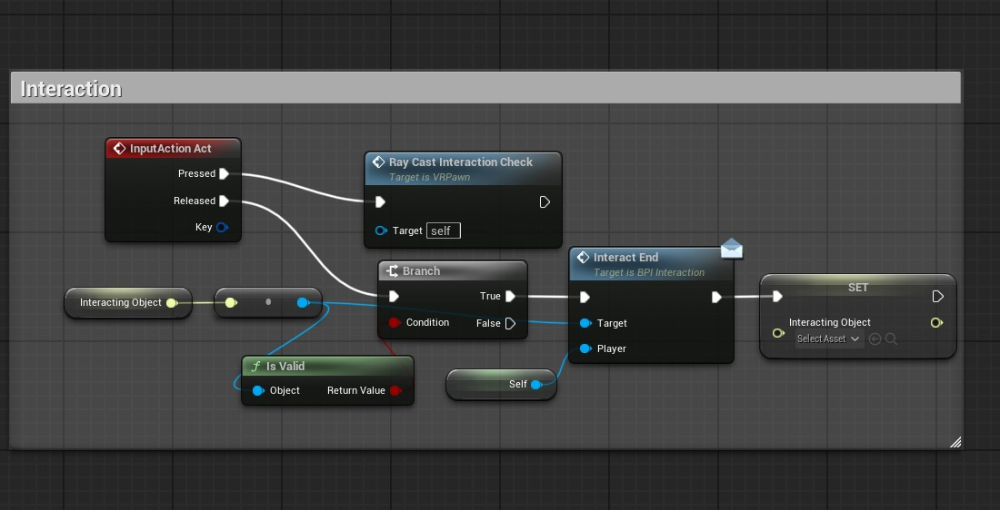

## Blueprints
# Player
Blueprint: VRPawn

Prefix local variables with the name of the function they achieve.

## Actions
### Primary Action
Trigger: Trigger Button (todo) / Left Click

Trigger handled by: InputAction Act

Relevant game objects implement: BPI_Interaction

# Sword Slash Action
Trigger: Arm Swing (todo) / <insert M&KB trigger> (todo)